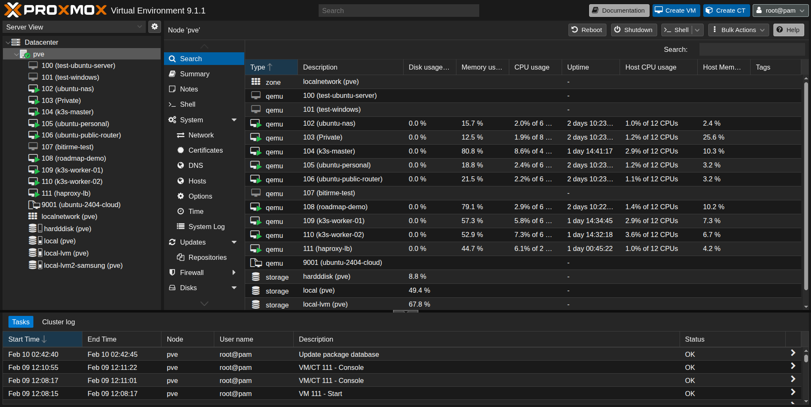
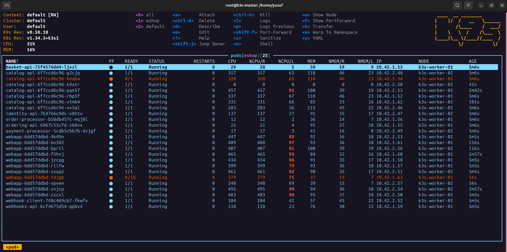
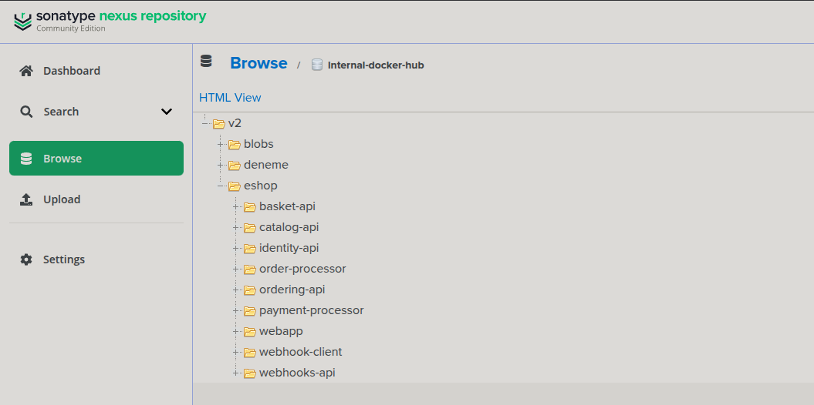
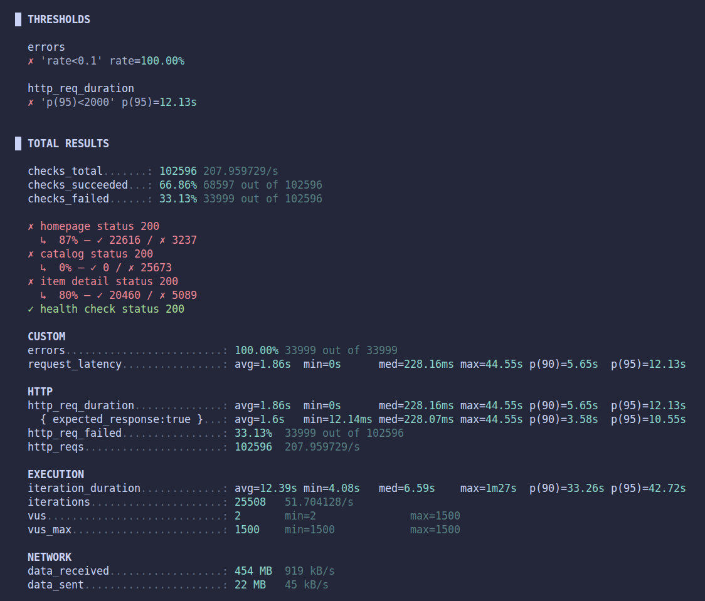
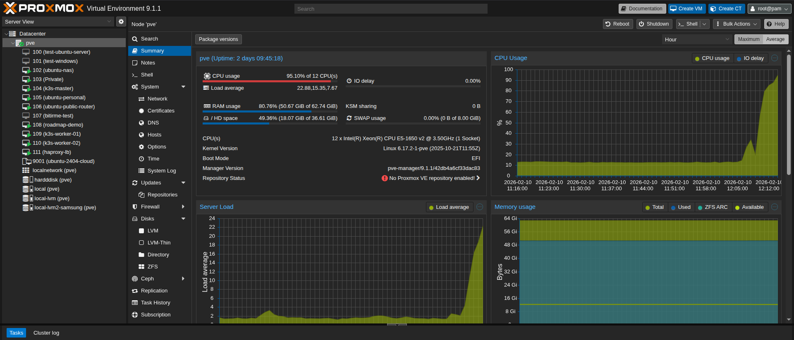

# eShop – From Code to Kubernetes

This is Microsoft's [eShop](https://github.com/dotnet/eShop) reference application. I took it, containerized every service with Docker, and deployed it on a **simulated on-premise environment** — a k3s Kubernetes cluster running on VMs in my homelab, with SSL termination, load balancing, and **observability** (Grafana, Tempo, Loki, Prometheus), plus **auto-scaling** with HPA.

The original project uses .NET Aspire for local development. I replaced that with real infrastructure: Docker Compose for local, Kubernetes manifests for production.

> **Why?** To learn DevOps by doing — not just theory. On-prem infrastructure, load balancing, Dockerfiles, networking, gRPC, ingress, secrets, observability, load testing, auto-scaling... all hands-on.


---

## What is eShop?

eShop is an online shop application. It has a web frontend where users can browse products, add items to a basket, and place orders. The backend is made of many small services (microservices) that each do one job.


---

## Services

| Service | What it does | Port |
|---|---|---|
| **webapp** | The web frontend (Blazor). Users see this in the browser. | 8080 |
| **identity-api** | Handles login and authentication (OpenID Connect). | 8080 |
| **catalog-api** | Manages the product list (CRUD). | 8080 |
| **basket-api** | Shopping cart. Uses gRPC for fast communication. | 8080 (HTTP) + 8081 (gRPC) |
| **ordering-api** | Creates and manages orders. | 8080 |
| **order-processor** | Background worker — processes submitted orders. | — |
| **payment-processor** | Background worker — simulates payment. | — |
| **webhooks-api** | Sends notifications when events happen. | 8080 |
| **webhook-client** | Receives webhook notifications. | 8080 |

## Infrastructure

| Component | What it does |
|---|---|
| **PostgreSQL** (pgvector) | Database for catalog, identity, ordering, and webhooks |
| **Redis** | Cache for the shopping basket |
| **RabbitMQ** | Message queue — services talk to each other through this |
| **Nginx** | Reverse proxy in front of the webapp (Docker Compose) |
| **Traefik** | Ingress controller (Kubernetes) |

---

## On-Premise Infrastructure

I simulated a real on-premise environment using VMs on my Proxmox homelab server. This is how a request travels from the internet to the app:

```
Internet
  │
  ▼
┌──────────────────────────┐
│  Nginx Proxy Manager     │  ← Edge server, terminates SSL (HTTPS → HTTP)
│  (reverse proxy)         │
└──────────┬───────────────┘
           │
           ▼
┌──────────────────────────┐
│  HAProxy                 │  ← Software load balancer (round-robin)
│  (load balancer VM)      │
└─────┬──────────┬─────────┘
      │          │
      ▼          ▼
┌──────────┐ ┌──────────┐
│ Worker 1 │ │ Worker 2 │    ← k3s worker nodes (run the pods)
└──────────┘ └──────────┘
      │          │
      └────┬─────┘
           ▼
┌──────────────────────────┐
│  Master Node             │  ← k3s control plane
└──────────────────────────┘
```

| VM | Role | What it does |
|---|---|---|
| **Nginx Proxy Manager** | Edge server | Faces the internet. Terminates SSL so internal traffic is plain HTTP. |
| **HAProxy** | Load balancer | Distributes requests to worker nodes using round-robin. |
| **Master** | k3s control plane | Manages the cluster, schedules pods. Does not run app workloads. |
| **Worker 1** | k3s worker | Runs application pods. |
| **Worker 2** | k3s worker | Runs application pods. |

All VMs run on a single **Proxmox** server. The infrastructure services (PostgreSQL, Redis, RabbitMQ) also run on this server and are exposed to the cluster using Kubernetes `Endpoints` resources.



---

## How I Did It — Step by Step

### Step 1: Dockerize Everything

I wrote a `Dockerfile` for each of the 9 services. They all use multi-stage builds:

1. **Build stage** — compile the .NET code
2. **Runtime stage** — only the compiled app, small image

Then I created a `docker-compose.yml` that starts all services + infrastructure (PostgreSQL, Redis, RabbitMQ, Nginx) together.

```bash
# Run locally with Docker Compose
cp .env.example .env
docker compose up --build
```

| URL | What |
|---|---|
| `http://localhost` | Web app |
| `http://localhost:5223` | Identity server |
| `http://localhost:15672` | RabbitMQ management UI |

### Step 2: Deploy to Kubernetes (k3s)

I set up a **k3s** cluster and created Kubernetes manifests for everything.

#### Folder structure

```
k8s/
├── namespace.yaml              # eshop namespace
├── secrets.yaml                # database passwords, Redis, RabbitMQ
├── infrastructure/
│   └── external-services.yaml  # PostgreSQL, Redis, RabbitMQ endpoints
├── services/
│   ├── webapp.yaml             # Deployment + Service + ConfigMap
│   ├── catalog-api.yaml
│   ├── basket-api.yaml
│   ├── identity-api.yaml
│   ├── ordering-api.yaml
│   ├── order-processor.yaml
│   ├── payment-processor.yaml
│   ├── webhooks-api.yaml
│   └── webhook-client.yaml
├── ingress/
│   └── ingress.yaml            # Traefik ingress rules
├── autoscaling/
│   └── hpa.yaml                # HorizontalPodAutoscaler
└── fix-traefik.yaml            # Traefik NodePort fix
```

#### How to deploy

```bash
# 1. Create namespace
kubectl apply -f k8s/namespace.yaml

# 2. Create secrets (edit passwords first!)
kubectl apply -f k8s/secrets.yaml

# 3. Infrastructure endpoints (PostgreSQL, Redis, RabbitMQ)
kubectl apply -f k8s/infrastructure/

# 4. Deploy all services
kubectl apply -f k8s/services/

# 5. Set up ingress
kubectl apply -f k8s/ingress/

# 6. Enable auto-scaling
kubectl apply -f k8s/autoscaling/
```



### Step 3: Ingress with Traefik

k3s comes with Traefik. I configured ingress rules so each service gets its own domain:

| Domain | Service |
|---|---|
| `eshop.marmaracse.xyz` | webapp |
| `identity.eshop.marmaracse.xyz` | identity-api |
| `webhook.eshop.marmaracse.xyz` | webhook-client |


### Step 4: Container Registry (Nexus)

I set up a private **Nexus** Docker registry at `192.168.1.175:8082`. All images are pushed there, and Kubernetes pulls from it using an `imagePullSecret`.

```bash
# Build and push an image
docker build -t 192.168.1.175:8082/eshop/webapp:v2 .
docker push 192.168.1.175:8082/eshop/webapp:v2
```



### Step 5: Observability (Grafana + Tempo + Loki + Prometheus)

Every service sends telemetry data (traces, metrics, logs) using **OpenTelemetry**:

```
Services → OTel Collector → Tempo (traces)
                           → Prometheus (metrics)
                           → Loki (logs)
                           → Grafana (dashboards)
```

| Tool | What it shows | Port |
|---|---|---|
| **Grafana** | Dashboards for everything | 3000 |
| **Tempo** | Distributed traces (follow a request across services) | 3200 |
| **Prometheus** | Metrics (CPU, request count, latency) | 9090 |
| **Loki** | Centralized logs from all services | 3100 |

<!-- TODO: Add screenshot of Grafana dashboard -->
<!--  -->

<!-- TODO: Add screenshot of a trace in Tempo -->
<!--  -->

### Step 6: Stress Testing with k6

I wrote a **k6** load test script to simulate many users at the same time.

The test sends requests to the homepage, catalog, and item pages. It starts with a few users and slowly increases to see when the app starts to slow down.

```bash
# Run the stress test
k6 run k6/stress-test.js
```

| Stage | Users | Duration |
|---|---|---|
| Warm-up | 0 → 500 | 1 min |
| Hold | 500 | 3 min |
| Spike | 500 → 1500 | 1 min |
| Hold | 1500 → 150 | 3 min |



My homelab Proxmor server was dying haha


### Step 7: Auto-Scaling with HPA

Without auto-scaling, Kubernetes just lets one pod struggle when there is too much traffic. I added **HorizontalPodAutoscaler** (HPA) so Kubernetes creates more pods when CPU is high.

| Service | Min Pods | Max Pods | Scale-up when |
|---|---|---|---|
| webapp | 1 | 20 | CPU > 50% or Memory > 70% |
| catalog-api | 1 | 20 | CPU > 50% or Memory > 70% |
| basket-api | 1 | 3 | CPU > 50% or Memory > 70% |
| ordering-api | 1 | 3 | CPU > 50% or Memory > 70% |

```bash
# Watch auto-scaling in action during a stress test
kubectl get hpa -n eshop -w
```
---

## Problems I Solved

### gRPC HTTP/2 Error

**Problem:** The webapp could not talk to basket-api. Error: `HTTP_1_1_REQUIRED`.

**Why:** The basket-api has two ports — 8080 (HTTP) and 8081 (gRPC/HTTP2). The webapp was connecting to port 8080 for gRPC calls, but that port does not support pure HTTP/2.

**Fix:** Changed the service discovery config in the webapp ConfigMap to point gRPC traffic to port 8081.

### OpenID Connect in Docker Network

**Problem:** Login did not work in Docker. The browser and the backend need different URLs for the identity server.

**Why:** When a user clicks "Login", the browser redirects to the identity server. The app was configured with `IdentityUrl=http://identity-api:8080` — this works for pod-to-pod communication, but the **browser** cannot resolve `identity-api` because that is an internal Docker/Kubernetes hostname. The browser needs a real URL like `localhost:5223` or `identity.eshop.marmaracse.xyz`.

**Fix:** I added a new `IdentityUrlInternal` variable so the app uses two separate URLs:
- `IdentityUrl` → the public URL for the browser (e.g. `https://identity.eshop.marmaracse.xyz`)
- `IdentityUrlInternal` → the internal URL for pod-to-pod token validation (e.g. `http://identity-api:8080`)

### Finding the Right Environment Variables

**Problem:** The original project uses .NET Aspire, which sets all the connection strings and service URLs automatically. When you remove Aspire, nothing is configured — the app just crashes.

**Why:** There is no documentation that says "these are the environment variables you need." The variable names are hidden inside the source code — things like `ConnectionStrings__catalogdb`, `services__basket-api__http__0`, `Identity__Url`, etc. Each service needs different ones.

**How I solved it:** Trial and error. I would start a service, read the error message, search the source code for the config key, add the right environment variable, and try again. I repeated this for every service until they all worked.

---

## Tech Stack

| Category | Technologies |
|---|---|
| **Application** | .NET 9, Blazor, gRPC, Entity Framework Core |
| **Containers** | Docker, Docker Compose |
| **Orchestration** | Kubernetes (k3s) |
| **Ingress** | Traefik |
| **Registry** | Nexus (private Docker registry) |
| **Database** | PostgreSQL (pgvector) |
| **Cache** | Redis |
| **Messaging** | RabbitMQ |
| **Observability** | OpenTelemetry, Grafana, Tempo, Loki, Prometheus |
| **Load Testing** | k6 |
| **Auto-Scaling** | HorizontalPodAutoscaler (HPA) |

---

## Credits

Based on [dotnet/eShop](https://github.com/dotnet/eShop) by Microsoft.
